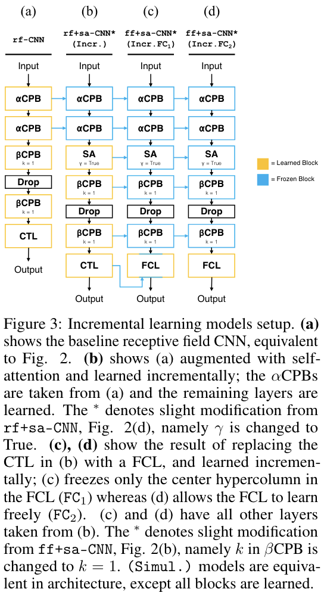

# Incremental Learning and Self-Attention Mechanisms Improve Neural System Identification

This repository serves as supporting material for the paper titled Incremental Learning and Self-Attention Mechanisms Improve Neural System Identification. The repository has been anonymized to abide by the the double-blind review process.

The README is structured as follows:

1. Dataset Sample
2. Modeling
3. Traditional (Simultaneous) Training
4. Incremental Training
5. Tuning Curves
6. Calculating Neuronal Tuning Metrics: Correlation (CORR.) and Peak Tuning (PT)
7. FCL Decomposition
8. Attention Highlighting

## 1. Dataset Sample

  

As the dataset has not been publicly released, we provide a small subsample of the monkey 1 site 1 (M1S1) data. The sample contains the 

* Training images
* Training responses
* Validation images
* Validation responses

See the [INSERT] jupyter notebook for more details.

## 2. Modeling

  

    
     
  

Models can be found in the modeling folder. Self attention is there, etc. See the freezing in inc.

## 3. Traditional (Simultaneous) Training

Traditional training scripts can be found in training folder.

## 4. Incremental Training

Incremental training scripts can be found in training folder. Note the loading based on model.

## 5. Tuning Curves

  

  

Generation of tuning curves found in analysis. See individual neuron tuning curves, and population average tuning curves.

## 6. Calculating Neuronal Tuning Metrics: CORR. and PT

See analysis folder. CORR. via pearson correlation function. PT_J and PT_S based on ranking and top 10 (1%).

## 7. FCL Decomposition

  

Extracting contributions found in analysis. Requires modifying model to save extra parameters.

## 8. Attention Highlighting

  

Extracting HH map, and then querying center. Requires modifying model to save extra parameters.

